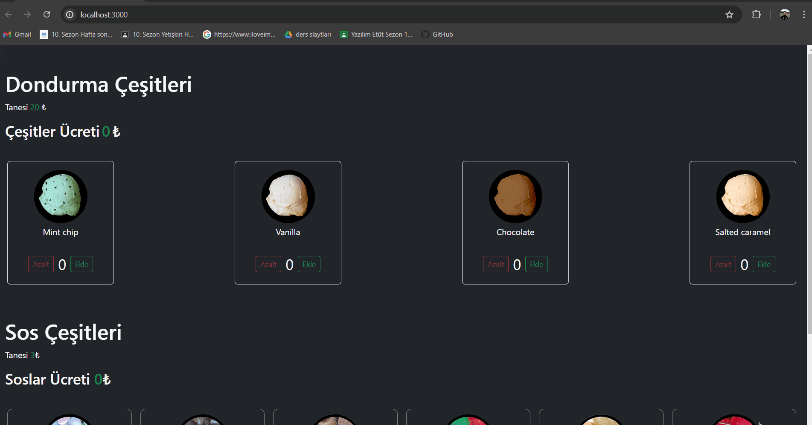

# Ice Cream App

This project is a web application where users can view, select and order various types of ice cream.
In the project, Jest and React Testing Library were used to test that components and functions worked correctly.

## Features

Users can list ice cream flavors.
Users can add ice cream and sauce to the cart.
Can edit or remove products in the cart.

## Libraries

- json-server
- bootstrap
- @testing-library/user-event@14.0
- axios@^0.27.2

